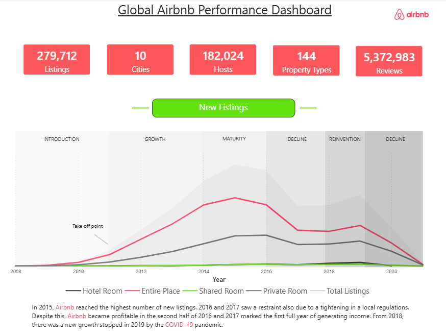
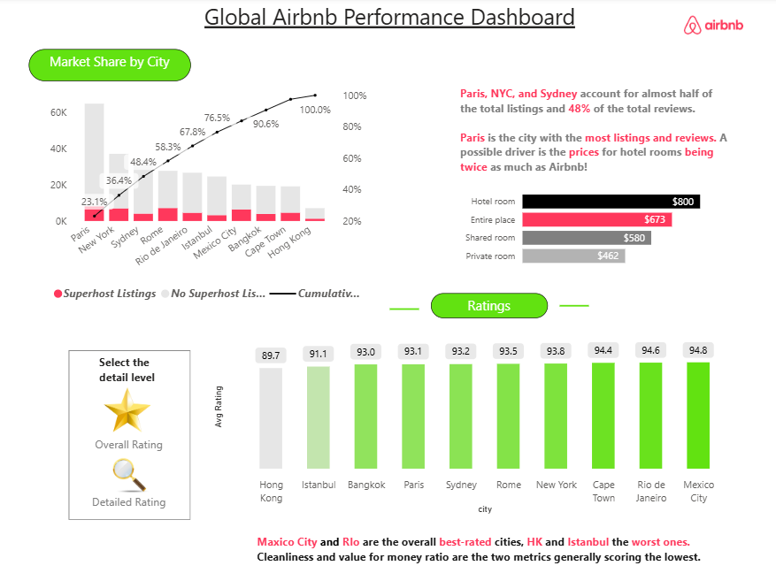

# 🏡 Global Airbnb Performance Dashboard (Power BI)

## 📊 Project Overview

This project presents a comprehensive analysis of Airbnb listings across multiple global cities using an interactive Power BI dashboard.

The dashboard focuses on:

* Listings growth over time
* Market share by city
* Pricing analysis
* Customer ratings

## 📂 Dataset

This project uses publicly available Airbnb data.
Note: The original dataset exceeds GitHub size limits, so dataset is not provided here.

🔗 Original Source: https://mavenanalytics.io/data-playground/airbnb-listings-reviews

### Notes:

* Full dataset can be accessed from the source link above.

---

## 🎯 Key Insights

* 📈 Airbnb listings peaked around **2015**
* 📉 Growth slowed due to **regulations (2016–2017)** and **COVID-19 impact**
* 🌍 **Paris, NYC, and Sydney** dominate listings and reviews
* 💰 Entire homes are significantly more expensive than shared/private rooms
* ⭐ **Mexico City & Rio** have highest ratings
* ⚠️ Cleanliness & value-for-money score lowest overall

---

## 🖼️ Dashboard Preview

### 🔹 Overview

### 🔹 Market Share by City

### 🔹 Ratings Analysis

---

## 🛠️ Tools & Technologies

* Power BI
* DAX (Data Analysis Expressions)
* Data Cleaning & Transformation
* Data Visualization

---

## 📂 Dataset

The dataset includes:

* Listings data
* City-level performance
* Pricing categories
* Review metrics

---

## 💡 Skills Demonstrated

* Data Cleaning
* Data Modeling
* DAX Calculations
* Dashboard Design
* Business Insight Generation

---

## 🤝 Connect with Me

If you like this project, feel free to connect or give a ⭐ to this repo!
